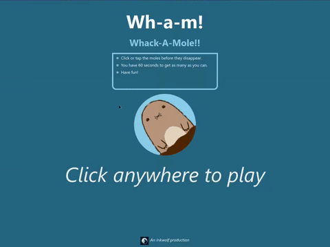

# WHACK-A-MOLE

**A simple whack-a-mole game made using React and React Native based on Ania Kubow's tutorial.**

[This here][1] ~~is~~was the link to the tutorial video.

While I mainly did this tutorial because of "whack-a-mole", it was also a good opportunity to learn about React Redux and React Native. Honestly, I still cannot properly wrap my head around Redux, and this app would have been a lot easier without it.

<p text-align='center'>



<em>Sample</em>
</p>

# Prerequisites
- `node` v18.19.1
- `expo.io`
- `react` v18

> [!NOTE]
> IF you already have an older version of node installed, I would recommend using `nvm` to manage multiple versions of node. With `nvm`, you can easily switch between different versions:
> ```bash
> source ~/.nvm/nvm.sh
> nvm install 18
> ```


## Usage
- After cloning the repo
    ```
    cd my-project
    npm start run
    ```
    >Or even 
    >```
    >expo start
    >```

- This should open a page in your browser. 
  - To test live on Android,  install the [expo app](https://play.google.com/store/apps/details?id=host.exp.exponent), and from the app, scan the QR code on the terminal
    >If it says network error on your android device, select `Tunnel` Connection from the left menu tab, and rescan the newly generated QR code
  - To test directly on your web browser, select `Run in web browser` from the left menu tab
  - Alternatively, it is possible to run them on "virtual" android or iOS (MacOS is required for testing on simulated iOS) devices, but I have not tried them yet. Please follow the [tutorial][1] for this approach  


## Future
- [ ] Introduce levels
- [x] Figure out ways to host this as both app and website
- [x] Add **Start** and **Reload** buttons
- [ ] Display Score and Player name at end 


[1]: https://www.youtube.com/watch?v=yrSFLZ_b0Aw&feature=youtu.be
[2]: https://www.cleanpng.com/png-pull-up-mole-fat-mole-cartoon-animation-2043565/